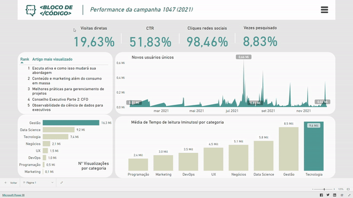

# Projetos de Business Intelligence (BI)

## Sobre

Bem-vindo ao meu repositório de Projetos de Business Intelligence (BI)! Aqui você encontrará uma coleção de projetos em Power BI, criados com o objetivo de simular casos reais de mercado. Este repositório também serve como uma plataforma para compartilhar meus trabalhos e acompanhar meu progresso em tópicos relacionados a Data Analytics e Data Science.

Sinta-se à vontade para explorar os projetos disponíveis, examinar os dashboards e mergulhar nas funcionalidades utilizadas!

## Tabela de Conteúdo

- [Projeto 01 - Análise da campanha de Marketing da Bloco de Código](#seção-1)

## Projeto 01 - Análise da campanha de Marketing

> Status do Projeto: Em desenvolvimento :warning:
